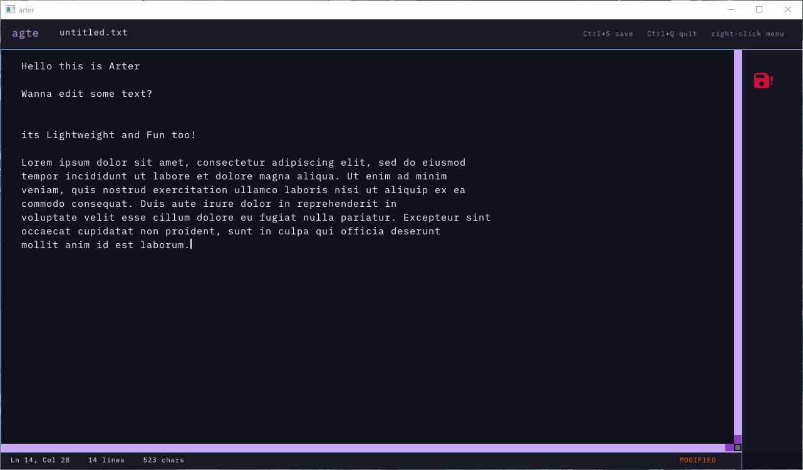

# arter

<p align="center">
	<strong>A small, sharp, keyboard-first text editor for the desktop.</strong><br>
	A modernized fork of <a href="https://github.com/BDestroyerOfWorlds/agte">agte</a>, built in C with raylib.
</p>

<p align="center">
	<a href="https://github.com/Yasurolled/Arter/actions/workflows/build.yml"></a>
	<a href="https://github.com/Yasurolled/Arter/blob/main/LICENCE.txt"></a>
	<a href="https://github.com/Yasurolled/Arter"></a>
</p>

<p align="center">
	
</p>

## Why arter?

arter keeps the immediacy of a terminal editor and gives it a focused graphical workspace. It starts quickly, stays lightweight, and puts the document at the center of the screen.

The project is a fork of agte with a responsive layout, a rebuilt application shell, cross-platform CMake support, and a more deliberate workflow for future development. It was developed with the help of GitHub Copilot.

## Features

- Responsive editor layout with toolbar, status bar, and save-state sidebar
- Keyboard-first editing with cursor movement and Shift selection
- Clipboard operations with current-line fallback when nothing is selected
- Selection replacement for typing, Enter, Tab, and paste
- Automatic caret scrolling and visible save-error feedback
- Right-click context menu for Copy, Cut, Paste, and Select All
- Resizable window, fullscreen toggle, and a 640x360 minimum size
- Embedded Lilex Nerd Font with icon indicators
- CMake build configuration for Windows, Linux, and macOS

## Quick start

```text
arter [filename]
```

The filename is optional. Without one, arter opens `untitled.txt` in the current directory. Missing files are created when saved.

## Controls

| Action | Shortcut |
| --- | --- |
| Move cursor | Arrow keys |
| Select text | Shift + movement keys |
| Start/end of document | Page Up / Page Down |
| Copy, cut, paste | Ctrl+C / Ctrl+X / Ctrl+V |
| Select all | Ctrl+A |
| Save | Ctrl+S |
| Quit | Ctrl+Q |
| Toggle fullscreen | F11 |
| Context menu | Right click |
| Indent | Tab |

When no text is selected, Copy and Cut operate on the current line.

## Build

arter requires CMake, raylib, and `raygui.h`. The recommended build uses CMake.

### Windows: MSYS2 UCRT64

Run these commands from the **MSYS2 UCRT64** terminal:

```bash
pacman -S --needed mingw-w64-ucrt-x86_64-toolchain mingw-w64-ucrt-x86_64-cmake mingw-w64-ucrt-x86_64-raylib
curl --fail --location --output raygui.h https://raw.githubusercontent.com/raysan5/raygui/master/src/raygui.h
cmake -S . -B build -G "MinGW Makefiles" -DRAYGUI_INCLUDE_DIR="$PWD"
cmake --build build
./build/arter.exe
```

### Linux

Install a C compiler, CMake, OpenGL/X11 development libraries, and raylib from your distribution or from source. Then build raylib 5.5, download raygui, and configure arter:

```bash
curl --fail --location --output raygui.h https://raw.githubusercontent.com/raysan5/raygui/master/src/raygui.h
cmake -S . -B build -DCMAKE_BUILD_TYPE=Release -DRAYGUI_INCLUDE_DIR="$PWD"
cmake --build build --parallel
./build/arter
```

### macOS

Install raylib with Homebrew, place `raygui.h` in the project root, and use the standard CMake commands above. The source does not depend on platform-specific input or file APIs.

## Project status

arter is usable for small text-editing sessions and is still evolving. Known limitations include no undo/redo stack, incomplete UTF-8 support, no file explorer, and no platform-specific file dialog.

## Contributing

See [CONTRIBUTING.md](CONTRIBUTING.md) for the development setup and pull request expectations. Notable changes are recorded in [DEVLOG.md](DEVLOG.md), and bug reports or feature ideas are welcome through GitHub Issues.

## License

arter is licensed under the [AGPL-3.0](LICENCE.txt). raylib and the embedded Lilex font remain under their respective licenses; see the files in `third_party/` and the header comments in `font_data.h`.
